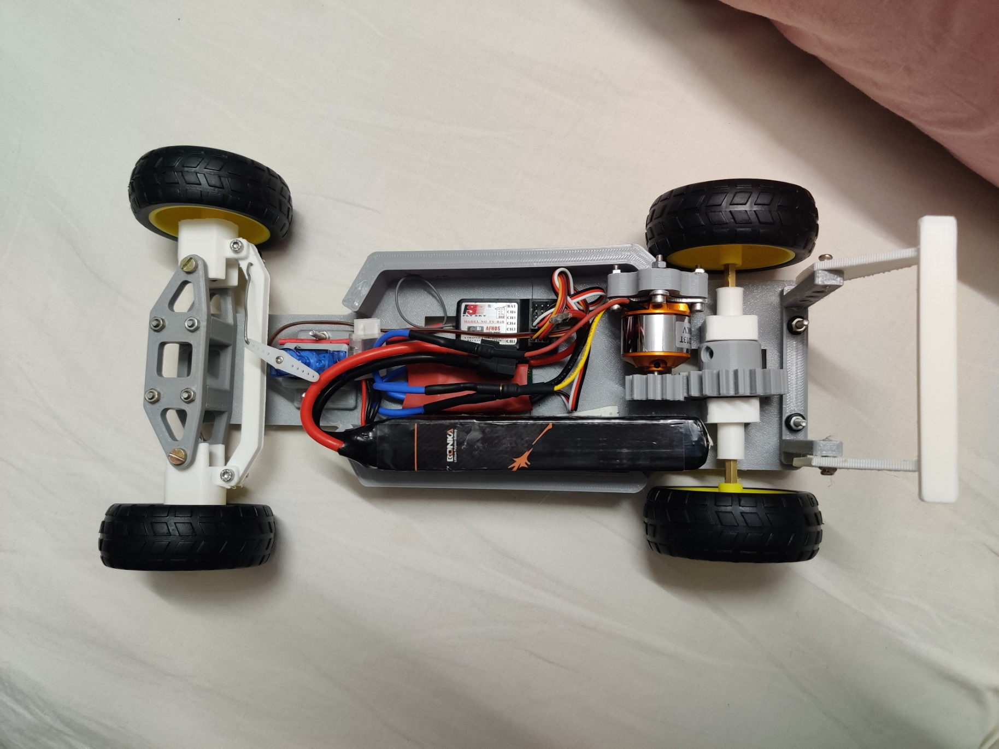

# High-speed-Brushless-motor-FPV-RC-car

Component | Details
Motor | Brushless DC Motor (possibly A2212)
Motor Drive | Gear transmission to rear axle
Steering | Front-wheel servo (SG90/MG90S)
Battery | 11.1V 3S 3300mAh 35C LiPo
ESC | BLDC ESC (11.1V compatible)
Chassis | 3D-printed, modular design
Drive Type | Rear-Wheel Drive (RWD)
Control System | Awaiting RC receiver or MCU setup

|  |  |
| --------------------------- | --------------------------- |

# camera coming soon
