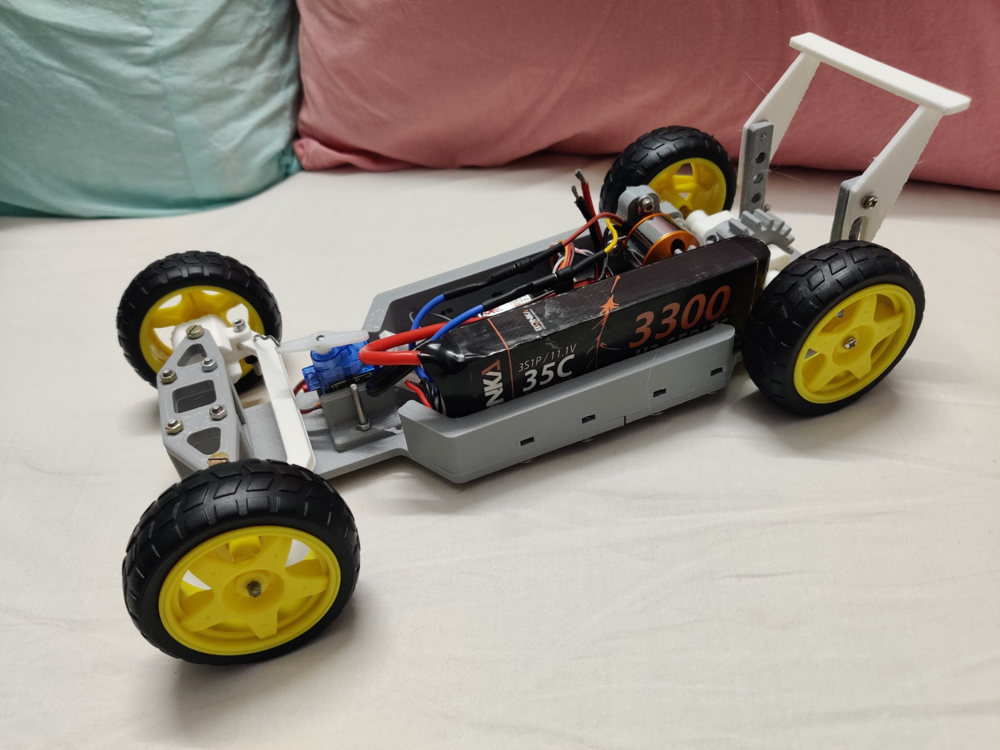
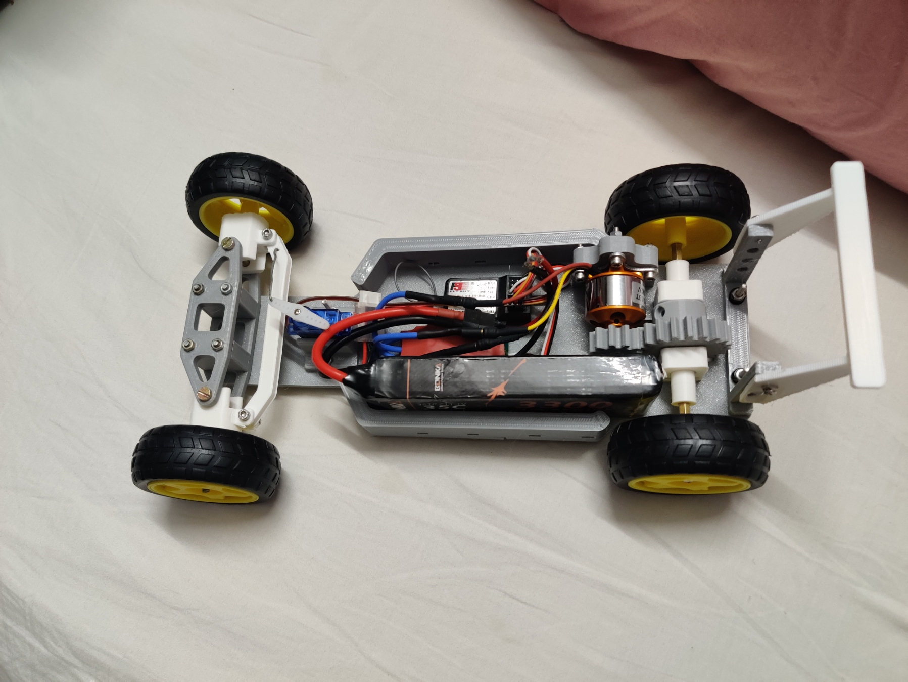

# High-speed-Brushless-motor-RC-car

### Component Summary Table (RC Car)

| **Component**         | **Description**                                      |
|-----------------------|------------------------------------------------------|
| **Drive Type**        | Rear-Wheel Drive (RWD)                               |
| **Motor**             | Brushless DC Motor ( A2212)                          |
| **Steering**          | Front-wheel steering with micro servo (SG90)         |
| **Battery**           | 11.1V (3S) 3300mAh Li-Po, 35C discharge rate         |
| **ESC**               | Brushless ESC with BEC                               |
| **Chassis**           | 3D-printed, lightweight, modular structure           |
| **Wheels**            | 4 wheels with yellow hubs and rubber tires           |
| **Transmission**      | Gear-based, motor to rear axle                       |

|  |  |
| --------------------------- | --------------------------- |

